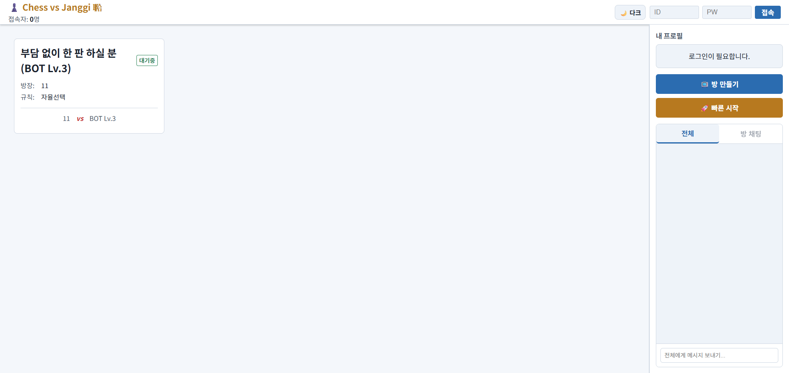
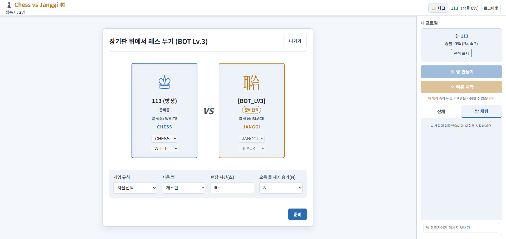
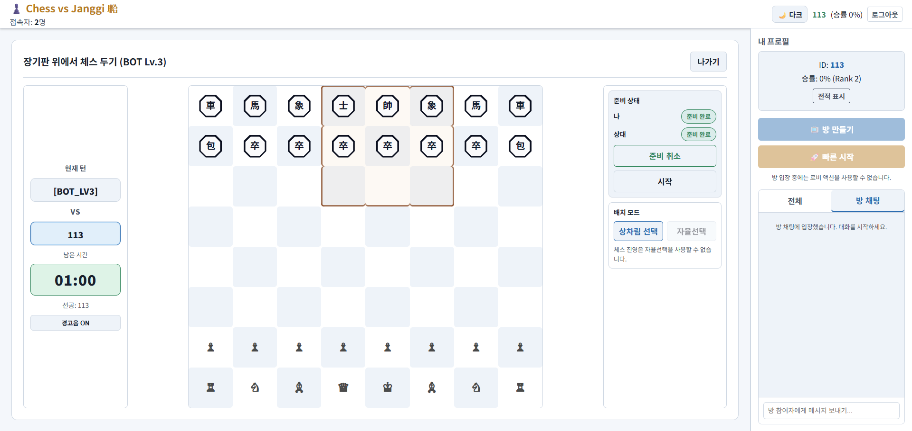

# Chess vs Janggi

서양 체스와 동양 장기가 하나의 보드에서 대결하는 비대칭 실시간 전략 웹 게임입니다.

## Live Demo

- Client: https://chess-vs-janggi-client.onrender.com/

## Project Overview

- 서로 다른 규칙(체스/장기)과 기물 가치 체계를 한 게임 룸에서 공존시키는 실험형 PvP 프로젝트입니다.
- 룸 기반 멀티플레이, 실시간 턴 동기화, 제한시간, 채팅, 기권/탈주 처리까지 한 흐름으로 설계했습니다.
- AI 대전은 Web Worker 기반으로 분리해 브라우저 메인 스레드 프리징 없이 동작합니다.

## Key Features

- 비대칭 대결
	- 체스와 장기 진영이 동일한 전장 규칙 안에서 상호작용하도록 룰 엔진을 구성했습니다.
- 실시간 멀티플레이
	- Socket.io 이벤트 계약 기반으로 방 생성/입장, 턴 진행, 룸 상태 갱신, 채팅을 동기화합니다.
- AI 플레이어 (난이도 1~3)
	- `src/workers/bot-worker.js`에서 연산을 처리해 UI 끊김을 줄였습니다.
	- 난이도 1: 랜덤, 난이도 2: 그리디, 난이도 3: 미니맥스+알파베타(기본 depth 3).
- 무가입 로그인 UX
	- 간단한 닉네임 기반 세션으로 즉시 플레이 가능한 로비 진입 경험을 제공합니다.

## Tech Stack

- Frontend
	- React 19, Vite, React Router, Custom Hooks
	- Socket.io Client
- Backend
	- Node.js, Express, Socket.io, CORS
- Deployment
	- Render 배포 (Client/Server 분리 운영)

## Directory Structure

```text
chess-vs-janggi-web/
├─ server/
│  └─ index.js                # Express + Socket.io 서버, 룸/매치 상태 관리
├─ src/
│  ├─ ai/                     # AI 코어 (룰 엔진/평가 함수/탐색)
│  ├─ components/             # 게임/로비 UI 컴포넌트
│  ├─ hooks/                  # 상태/세션/알림/타이머 커스텀 훅
│  ├─ pages/                  # 페이지 단위 화면
│  ├─ socket/                 # 소켓 이벤트 계약/emit/알림 처리
│  └─ workers/
│     └─ bot-worker.js        # AI 연산 워커 (메인 스레드 분리)
└─ docs/                      # 아키텍처/규칙/회귀 체크 문서
```

## Screenshots

| 로비 | 룸 설정 | 대국 화면 |
|---|---|---|
|  |  |  |

> 권장 해상도: 가로 1600px 이상, 동일 비율(16:9 또는 16:10)로 통일

## Getting Started

### 1) Install

```bash
npm install
```

### 2) Run (터미널 2개 필요)

```bash
# Terminal A: Frontend (Vite)
npm run dev
```

```bash
# Terminal B: Backend (Socket server)
npm run server
```

### 3) Build

```bash
npm run build
```

## Environment Variables

`chess-vs-janggi-web/.env` 파일을 만들고 아래 키를 설정하세요.

```bash
# Frontend
VITE_SOCKET_URL=http://localhost:3001

# Backend
PORT=3001
CORS_ORIGIN=http://localhost:5173
```

> `CORS_ORIGIN`은 쉼표(`,`)로 여러 Origin을 지정할 수 있습니다.

## Scripts

- `npm run dev` : 프론트 개발 서버 실행
- `npm run server` : 백엔드(Socket) 서버 실행(nodemon)
- `npm run start` : 백엔드 서버 실행(node)
- `npm run build` : 프로덕션 빌드
- `npm run preview` : 빌드 결과 미리보기

## Notes

- 이 프로젝트는 메모리 기반 룸 상태를 사용합니다. 서버 재시작 시 진행 상태는 초기화됩니다.

